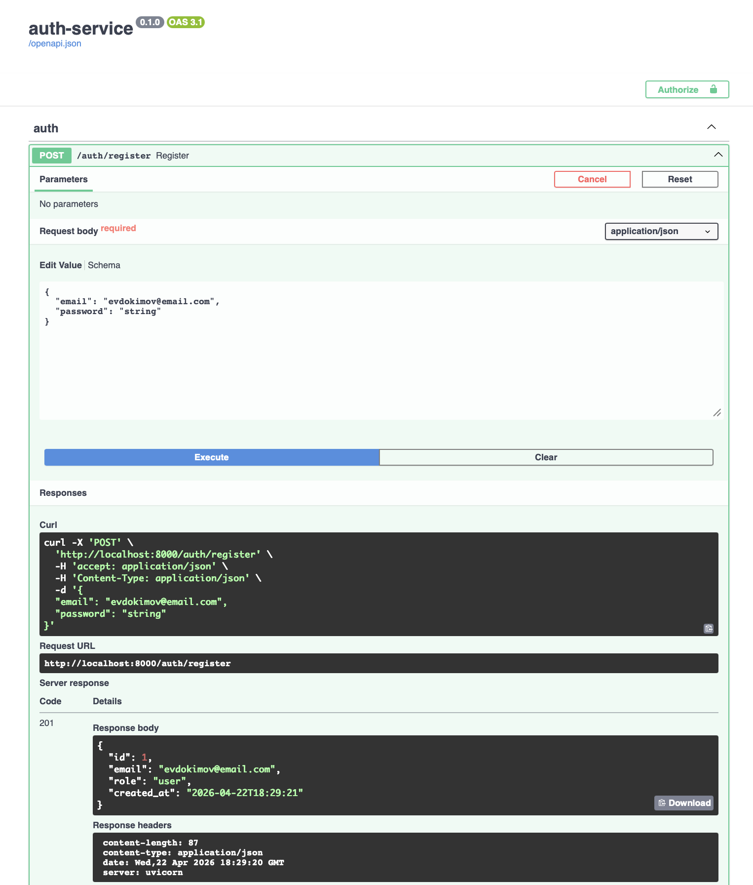
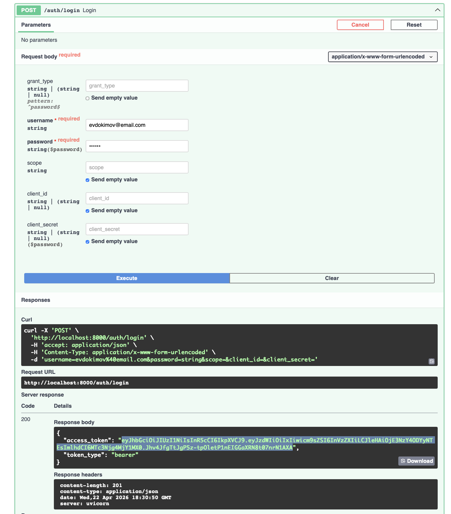
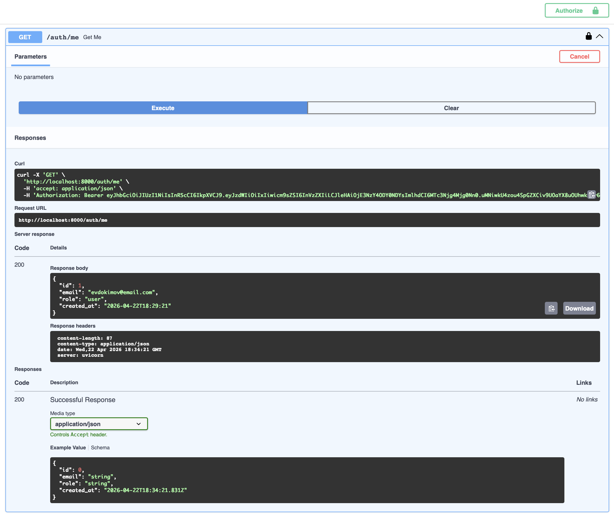
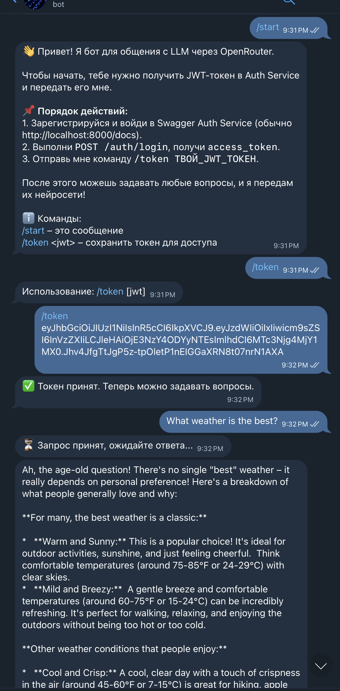

# LLM-бот: двухсервисная система

Система состоит из двух независимых сервисов:

- **Auth Service** (FastAPI) — управление пользователями, выпуск JWT.
- **Bot Service** (aiogram + Celery) — Telegram-бот с доступом к LLM сервиса OpenRouter.

## Архитектура
- **Auth Service** хранит пользователей в SQLite, выдаёт токен JWT (HS256).
- **Bot Service** принимает JWT от пользователя, валидирует его без обращения к Auth Service, хранит токен в Redis.
- Запросы к LLM обрабатываются асинхронно через Celery + RabbitMQ.

## Запуск

1. Создайте и заполните файлы с названиями `.env` в каждом сервисе (примеры в `auth_service/.env.example`, `bot_service/.env.example`).
2. Запустите инфраструктуру и сервисы через Docker Compose:

```
docker-compose up -d
```

## Использование

1. Зайдите в сервис аутентификации: http://localhost:8000/
    - Зарегистрируйтесь в сервисе (логин и пароль любой)
    
    - Залогиньтесь со своим паролем и скопируйте токен, выданный программой. Срок действия токена по умолчанию - 60 минут.
    
    - Можно войти с токеном в правом верхнем углу и проверить логин в /me
    

2. Найдите вашего бота в телеграмм, отправьте токен и общайтесь с ним


3. Можно увидеть очередь сообщений в [панели RabbitMQ](http://localhost:15672)
[RabbitMQ](readme_pictures/rabbit.png)


## Тестирование

Для локального тестирования работоспособности, в директории каждого сервиса можно выполнить:
```
source .venv/bin/activate
uv run pytest
```
